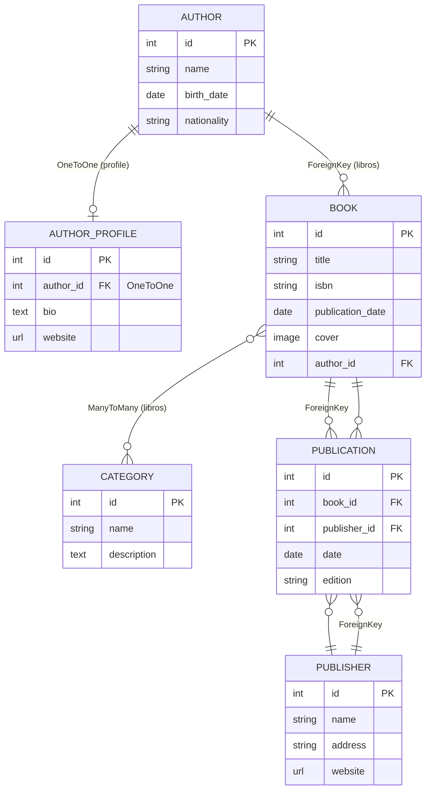

# Laboratorio 4 DAE — Relaciones entre modelos en Django

## 0. Requisitos y cómo reproducir

**Entorno:**

- Python 3.11
- Django 5.2.x y Pillow (ver `requirements.txt`)

```bash
python -m venv venv
venv\Scripts\activate              # Windows
pip install -r requirements.txt
python manage.py migrate
python manage.py createsuperuser   # usuario: admin / contraseña: admin123
python manage.py runserver
```

**Carga de datos de prueba:**

- Desde `/admin/` (todos los modelos están registrados en `library/admin.py`), o ejecutando:

```bash
python load_data.py
```

**Consultas y pruebas registradas:**

```bash
python test_consultas.py   # consultas de ida, vuelta y filtrado (punto 9)
python test_protect.py     # prueba de borrado con PROTECT (punto 10)
python test_view.py        # renderizado de la plantilla de detalle (punto 11)
```

> **Nota sobre la versión:** el encabezado autogenerado de `config/settings.py` menciona
> Django 6.1.1, pero esa versión no está publicada en PyPI. El proyecto se ejecuta y valida con
> Django 5.2.17 (última estable/LTS disponible). Se añadió
> `DEFAULT_AUTO_FIELD = 'django.db.models.BigAutoField'` para mantener la coherencia de las migraciones.

---

## 1. Diagrama de modelos



### Diagrama ASCII

```
+----------------+          +---------------------+
|     Author     | 1     1  |   AuthorProfile     |
|----------------|----------|---------------------|
| name           |          | bio                 |
| birth_date     |          | website             |
| nationality    |          | author (OneToOne)   |
+----------------+          +---------------------+
        | 1
        | (ForeignKey, related_name='libros')
        | N
+----------------+          +---------------------+
|      Book      | M      N |     Category        |
|----------------|----------|---------------------|
| title          |          | name                |
| isbn           |          | description         |
| cover          |          +---------------------+
| author (FK)    |
+----------------+
        | 1
        | N
+----------------+          +---------------------+
|  Publication   | N      1 |     Publisher       |
|----------------|----------|---------------------|
| date           |          | name                |
| edition        |          | address             |
| book (FK)      |          | website             |
| publisher (FK) |          +---------------------+
+----------------+
```

## 2. Relaciones implementadas

| Relación | Tipo | Detalle |
|----------|------|---------|
| Book → Author | `ForeignKey` | `on_delete=PROTECT`, `related_name='libros'` |
| AuthorProfile → Author | `OneToOneField` | `on_delete=CASCADE`, `related_name='profile'` |
| Book ↔ Category | `ManyToManyField` | `related_name='libros'` (tabla intermedia automática `library_book_categories`) |
| Book ↔ Publisher | `ManyToManyField` con `through='Publication'` | El modelo intermedio `Publication` guarda `date` y `edition` |

### Justificación de las decisiones

Cada relación se eligió según la cardinalidad real del caso:

- **`Book → Author` como `ForeignKey`** — un libro tiene exactamente un autor, pero un autor escribe muchos libros (uno-a-muchos). El `ForeignKey` vive en `Book` (el lado "muchos"). No podría ser `OneToOneField` (un autor podría tener un único libro) ni `ManyToManyField` (un libro tendría varios autores). Se usa `on_delete=PROTECT` para impedir borrar un autor que aún tiene libros y evitar perder catálogo por accidente.
- **`AuthorProfile → Author` como `OneToOneField`** — cada autor tiene un único perfil biográfico y cada perfil pertenece a un único autor. Un `ForeignKey` permitiría varios perfiles por autor (o el mismo perfil para varios autores), lo que no corresponde al caso; el `OneToOneField` garantiza la exclusividad y el acceso directo `author.profile`. Se usa `on_delete=CASCADE` porque el perfil no tiene sentido sin su autor.
- **`Book ↔ Category` como `ManyToManyField`** — un libro puede estar en varias categorías y una categoría contiene varios libros (muchos-a-muchos). Un `ForeignKey` obligaría a una sola categoría por libro. Como la relación no necesita atributos propios, se deja la tabla intermedia automática (`library_book_categories`).
- **`Book ↔ Publisher` como `ManyToManyField` con `through='Publication'`** — también es muchos-a-muchos (un libro puede tener varias ediciones/publicaciones y una editorial publica varios libros), pero aquí la relación tiene **datos propios** (`date` y `edition`). Por eso se usa `through` apuntando al modelo intermedio `Publication`, que guarda esos atributos y se consulta desde ambos lados (`book.publication_set.all()` y `publisher.publication_set.all()`, además del acceso inverso `publisher.libros.all()`).

## 3. Tablas creadas en la base de datos

```
library_author
library_authorprofile
library_book
library_book_categories   <-- intermedia automática del ManyToMany
library_category
library_publication       <-- modelo intermedio explícito (Book <-> Publisher)
library_publisher
```

## 4. Consultas registradas en la consola de Django

> Estas consultas se pueden reproducir ejecutando `python test_consultas.py`.

### Consulta de ida (libro.autor)

```python
b = Book.objects.get(title='Cien años de soledad')
b.author.name
```

**Resultado:**

```
CONSULTA DE IDA (libro.autor):
  libro: Cien años de soledad
  autor: Gabriel García Márquez
```

### Consulta de vuelta (autor.libros.all())

```python
a = Author.objects.get(name='Gabriel García Márquez')
a.libros.all()
```

**Resultado:**

```
CONSULTA DE VUELTA (autor.libros.all()):
  autor: Gabriel García Márquez
  libros: ['Cien años de soledad', 'El amor en los tiempos del cólera']
```

### Consulta de filtrado con doble guion bajo

```python
Book.objects.filter(author__name='Mario Vargas Llosa')
Book.objects.filter(categories__name='Realismo mágico')
```

**Resultado:**

```
CONSULTA DE FILTRADO (doble guion bajo):
  libros de Mario Vargas Llosa: ['La casa verde', 'La ciudad y los perros']
  libros en Realismo mágico: ['Cien años de soledad', 'La casa verde']
```

## 5. Prueba de borrado: CASCADE vs PROTECT

> Reproducible con `python test_cascade.py` (CASCADE) y `python test_protect.py` (PROTECT).

### Con `on_delete=CASCADE`

Al borrar al autor **Mario Vargas Llosa** (que tenía 2 libros):

```
ANTES: libros de Mario Vargas Llosa -> ['La casa verde', 'La ciudad y los perros']
Total libros antes: 4
DESPUES: Total libros: 2
Autores restantes: ['Gabriel García Márquez']
Libros restantes: ['Cien años de soledad', 'El amor en los tiempos del cólera']
```

**Conclusión:** con `CASCADE`, al borrar el autor se borran en cascada todos sus libros.

### Con `on_delete=PROTECT`

Al intentar borrar al autor **Gabriel García Márquez** (que tenía 2 libros):

```
ANTES: libros de Gabriel García Márquez -> ['Cien años de soledad', 'El amor en los tiempos del cólera']
Total libros antes: 2

Intentando borrar al autor con PROTECT...
ProtectedError: no se puede borrar porque tiene libros relacionados.
Objetos protegidos: ['Cien años de soledad', 'El amor en los tiempos del cólera']

DESPUES: Total libros: 2
Autores restantes: ['Gabriel García Márquez']
```

**Conclusión:** con `PROTECT`, Django lanza `ProtectedError` y bloquea el borrado del autor mientras tenga libros relacionados.

## 6. Plantilla de detalle de libro

La vista `book_detail` (URL `/book/<pk>/`) renderiza la plantilla `library/templates/library/book_detail.html`, que muestra:

- **Autor**: nombre, fecha de nacimiento, nacionalidad, biografía y sitio web (vía `book.author.profile`).
- **Categorías**: iterando `book.categories.all`.
- **Editorial**: iterando `book.publication_set.all` (modelo intermedio), mostrando nombre, fecha y edición.

**Resultado renderizado (Status 200):**

```html
<h1>Cien años de soledad</h1>

<h2>Autor</h2>
<p><strong>Nombre:</strong> Gabriel García Márquez</p>
<p><strong>Fecha de nacimiento:</strong> March 6, 1927</p>
<p><strong>Nacionalidad:</strong> Colombiana</p>
<p><strong>Biografía:</strong> Premio Nobel de Literatura 1982.</p>
<p><strong>Sitio web:</strong> https://example.com/ggm</p>

<h2>Categorías</h2>
<ul>
    <li>Novela</li>
    <li>Realismo mágico</li>
</ul>

<h2>Editorial</h2>
<ul>
    <li>Editorial Sudamericana (May 30, 1967 - 1ª edición)</li>
</ul>
```

## 7. Capturas de pantalla requeridas

1. **Admin de Django** (`http://127.0.0.1:8000/admin/`) mostrando los modelos registrados.
2. **Listado de libros** en el admin con los 4 libros cargados.
3. **Detalle de un libro** en el admin mostrando las categorías seleccionadas.
4. **Consola de Django** con las consultas de ida, vuelta y filtrado.
5. **Consola de Django** con la prueba de borrado CASCADE.
6. **Consola de Django** con la prueba de borrado PROTECT (ProtectedError).
7. **Página de detalle del libro** (`http://127.0.0.1:8000/book/1/`) renderizada.

## 8. Credenciales del superusuario

- **Usuario:** `admin`
- **Contraseña:** `admin123`